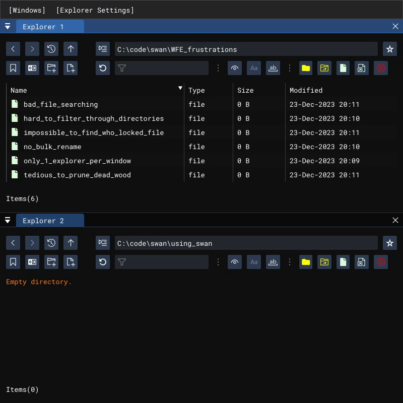
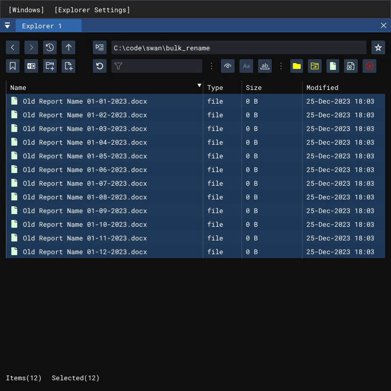

# Swan

*Transform your Windows file management experience into a swan's elegant dance.*

Swan is a substitute to the Windows File Explorer (WFE), for those wanting to squash the WFE frustrations (e.g., myself).

## What's not to love about the Windows File Explorer?

*Many things, unfortunately.*

- **Only 1 explorer per window**
  - Want to work between 2 explorers at once? You need 2 windows open. Want 3 explorers? Have fun managing 3 separate windows!
  - *Swan solves this by providing 4 explorers in its single window - dock them however suits you best.*

- **Hard to filter through a directory to find files with particular names.**
  - The "Search" feature really ain't it because...
    - It's slow.
    - It's always recursive.
  - *Swan solves this by having a dedicated filter for the current working directory.*

- **No bulk rename feature.**
  - *Swan solves this with a powerful and user friendly bulk renaming tool, for simple and complex renaming situations.*

- **It's hard to find a file when you don't know where it is.**
  - WFE "Search" consistently disappoints its slow performance, freezing, crashing... seriously, what is Microsoft doing with that thing?
  - *Swan will eventually solve this by providing a fast, dedicated file finder which elegantly integrates with the explorer.*

- **Impossible to figure out who locked a file you're trying to move/rename/delete.**
  - *Swan will eventually solve this by finding the culprit, and giving you disciplinary options*

- **Tedious to prune dead wood from your filesystem efficiently**
  - Sometimes you want to find empty directories in a particular region - have fun opening then one at a time to find out which ones are empty!
  - *Swan will eventually solve this with its analyze feature, letting you find and discipline empty directories quickly*

## Features

### Filtering

Demo coming soon.

### Bulk renaming

Quickly slice and dice file names for multiple files at once.

- Preview before and after prior to renaming
- Insert arbitrary counter with customizable start and step values using `<counter>`
- Insert current file name using `<name>`
- Insert current file extension using `<ext>`
- Insert current file extension with a leading dot using `<dotext>`
- Insert file size (in bytes) using `<bytes>`

## Attributions

- <a href="https://ezgif.com/video-to-gif" title="site used for making GIFs">GIFs made using ezgif.com</a>
- <a href="https://www.flaticon.com/free-icons/swan" title="swan icons">Swan icons created by Freepik - Flaticon</a>
- <a href="https://www.flaticon.com/free-icons/lightweight" title="lightweight icons">Lightweight icons created by Icongeek26 - Flaticon</a>
- <a href="https://www.flaticon.com/free-icons/origami" title="origami icons">Origami icons created by smalllikeart - Flaticon</a>
- <a href="https://www.flaticon.com/free-icons/bird" title="bird icons">Bird icons created by berkahicon - Flaticon</a>
