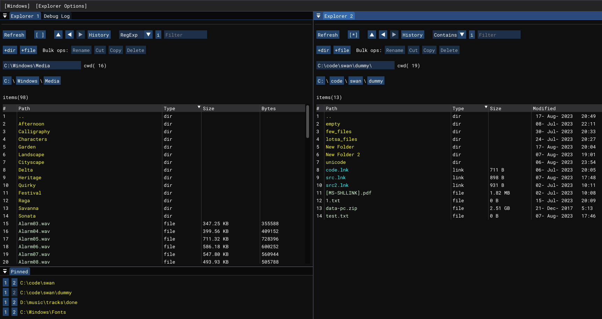

# swan

The <u>sw</u>iss <u>a</u>rmy k<u>n</u>ife program for Windows. One program to replace many, featuring:

- [ ] Powerful [file explorer](#explorer) (wayyy better than Windows Explorer)
- [ ] Super fast file finder (Windows Explorer? pfff)
- [ ] Fast, useful terminal (unlike Command Prompt)
- [ ] yt-dlp frontend

## Explorer

## Problems with Windows Explorer which swan's Explorer solves

- Single pane per window
- Lack of useful filtering (search exists, but is not fast enough)
- No bulk renaming
- Inability to tell if a directory has things inside without looking inside (file? directories?)
- Inability to see/kill processes which are locking a file

## Feature List

Note: cwd = current working directory

- [x] Unicode support
- [x] Multiple explorer panes
- [x] Sort by any column - name, size, entry type, creation date, last modified date, etc.
- [x] Full support for unix separator - `/` instead of `\\`
- [x] Create empty directory in cwd
- [x] Create empty file in cwd
- [ ] File preview

<!-- TODO: GIF demo -->
- Pin directories (similar to Quick Access in Window File Explorer)
  - [x] Pin/unpin
  - [ ] Reorder pins

<!-- TODO: GIF demo -->
- Basic navigation with double clicks
  - [x] Change to a directory by double clicking it
  - [x] Open a file or shortcut to file by double clicking it
  - [x] Navigate through directory shortcut by double clicking it
  - [x] Go to parent directory with up arrow or optional `..` directory

<!-- TODO: GIF demo -->
- Advanced selection with single clicks and modifiers
  - [x] `Left click` a directory to make it the current selection (clears any previous selection)
  - [x] `Ctrl + left click` a directory to add it to current selection (does not clear previous selection)
  - [x] `Shift + left click` a directory to add range to current selection (does not clear previous selection)
  - [x] `Escape` to clear current selection

- Various refresh modes
  - [x] `Manual` - button or Ctrl-r
  - [x] `Automatic` - auto refreshes on configured interval
  - [x] `Adaptive` - automatic for directories with <= N entries where N is user defined, falls back to manual for directories with > N entries
  - [x] Selection maintained between refreshes

<!-- TODO: GIF demo -->
- Filter entries in cwd
  - [x] `Contains` mode - searches for substring
  - [x] `RegExp` mode - full Regular Expression support
  - [ ] `Glob` mode - basic wildcards like * and ?
  - [x] Case sensitive and insensitive option for all modes
  - [ ] Discriminate by entry type - e.g. filter for files only, which match pattern

<!-- TODO: GIF demo -->
- Context menu for directory entries (accessed with right click)
  - [x] Copy file/directory name - e.g. `file.cpp`
  - [x] Copy file/directory path - e.g. `C:\directory\file.cpp`
  - [x] Reveal in File Explorer - for when you need the odd functionality we don't yet have
  - [x] Rename
  - [ ] Create shortcut
  - [ ] Custom commands

<!-- TODO: GIF demo -->
- Track directory history
  - [x] Go back/forward in history with left/right arrows
  - [x] View and select from history with popup window

- Bulk file operations
  - [ ] Copy files
    - [ ] Undo
  - [ ] Copy directories
    - [ ] Undo
  - [ ] Cut (move) files
    - [ ] Undo
  - [ ] Cut (move) directories
    - [ ] Undo
  - [ ] Delete files
    - [ ] Undo
  - [ ] Delete directories
    - [ ] Undo
  <!-- TODO: GIF demo -->
  - Bulk renaming
    - [x] Preview of current pattern's before/after tranformation
    - [x] Arbitrary counter with configurable start and step values
    - [x] Refer to current name minus extension using `<name>` (e.g. if `file.cpp`, `<name>` = `file`)
    - [x] Refer to current extension using `<ext>` (e.g. if `file.cpp`, `<ext>` = `cpp`, blank for directories)
    - [x] Refer to size in bytes using `<bytes>` (= 0 for directories)
    - [ ] Transactional
    - [ ] Undo

<!-- TODO: GIF demo -->
- Deal with locked files
  - [ ] See processes blocking an operation
  - [ ] Kill processes blocking an operation

<!-- TODO: GIF demo -->
- Show directory preview
  - [ ] Number of direct child files
  - [ ] Number of direct child directories
  - [ ] Longest directory chain depth
  - [ ] Recursive size of all children

## Performance TODOs

- [ ] Cache pretty size, modified timestamp, created timestamp
